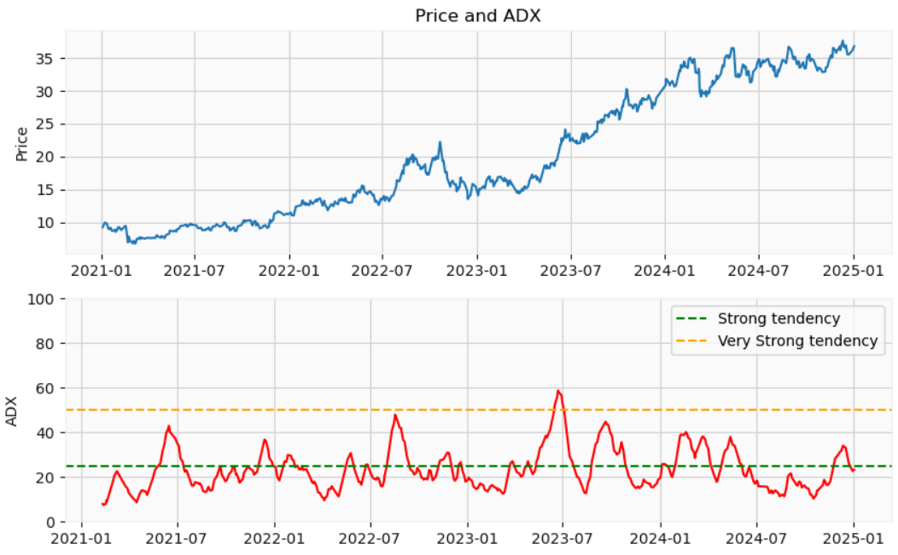
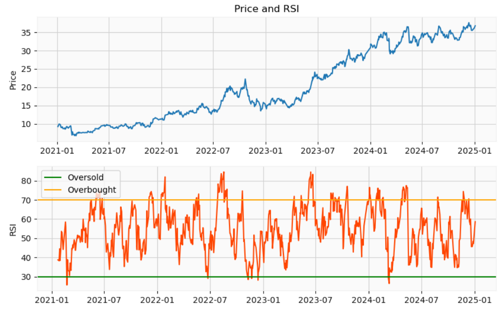
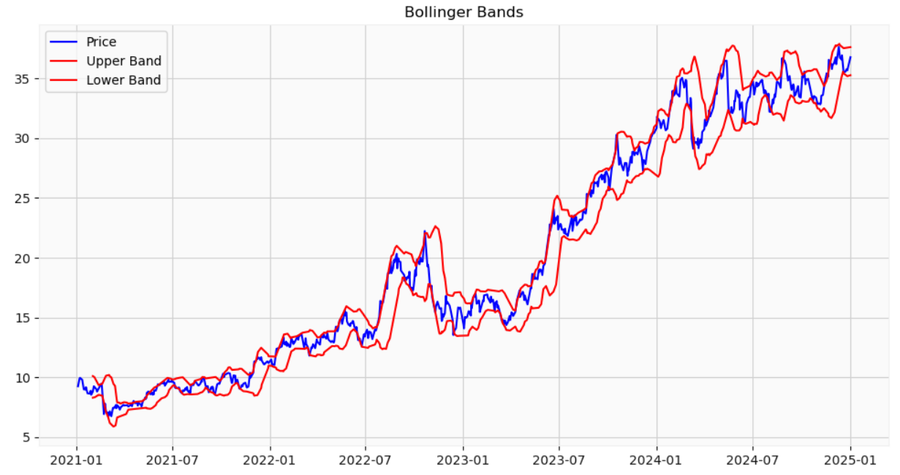

# Stock Price Time Series Analysis
See the notebook of this project [here](stock_price.ipynb)

This project focuses on the analysis of stock price data using time series analysis techniques. The goal is to explore the historical performance of a stock and identify trends, momentum, volatility, and potential trading signals using various technical indicators.

## Overview
The analysis includes the following key components:

Histogram of Returns: Analyzing the distribution of returns to understand the stock's behavior.
Candlestick Chart: A visual representation of price movements, showing the open, high, low, and close prices over time.

#### Trend Indicators:
Moving Averages: Simple and Exponential Moving Averages (SMA and EMA) to identify trends.
Average Directional Index (ADX): A measure of trend strength.
#### Momentum Indicator:
Relative Strength Index (RSI): Identifying overbought or oversold conditions.
#### Volatility Indicator:
Bollinger Bands: Visualizing the stock's volatility.

## Tools
The tools used were Python (Pandas, Numpy, Matplotlib, TA-Lib, yfinance), Jupyter Notebook, and Github (version control).

## Some visualizations of the analysis

Plot of moving averages:

Trend indicator: Average Directional Index (ADX)

Momentum indicator: Relative Strength Index (RSI)

Volatility indicator: Bollinger bands

## 8. Contact me

+ Linkedin: https://www.linkedin.com/in/ricardo-bortolotti/

+ Github: https://github.com/ricardo-bortolotti

+ Gmail: ricardo.t.bortolotti@gmail.com
